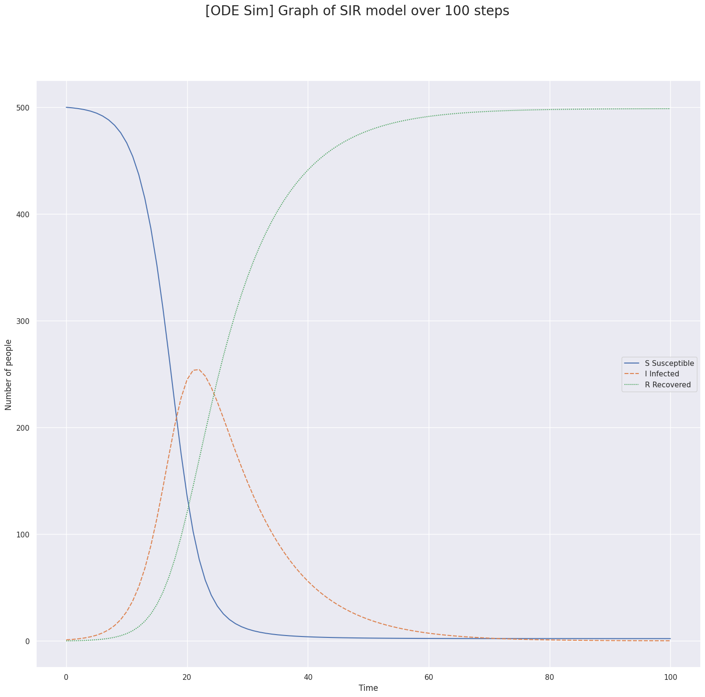
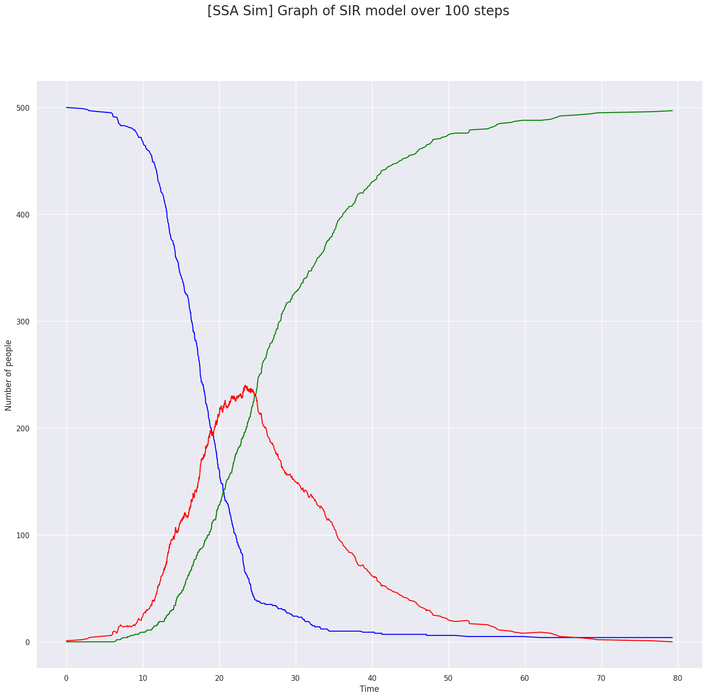
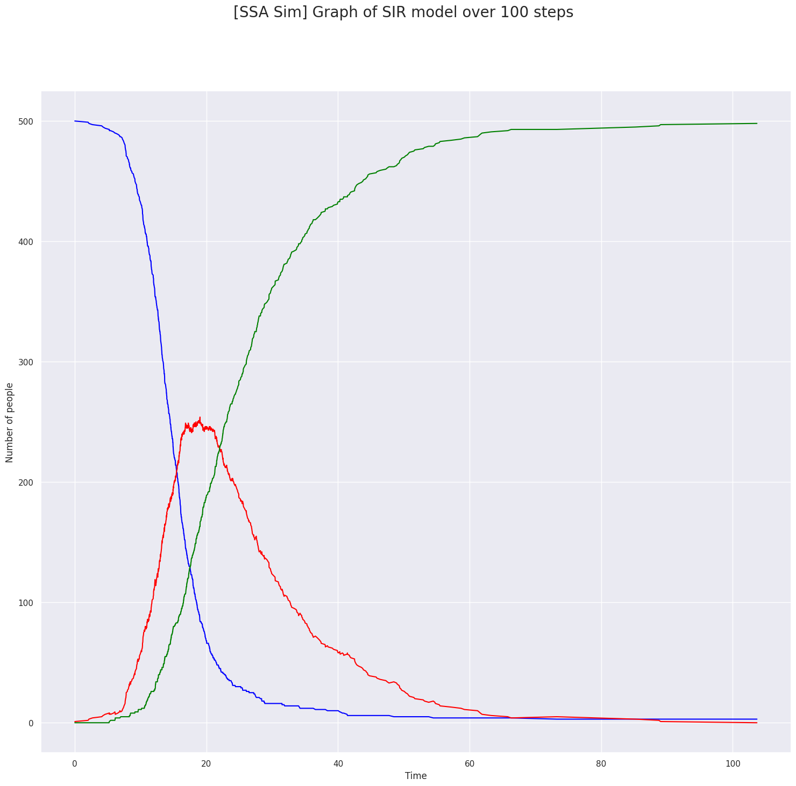
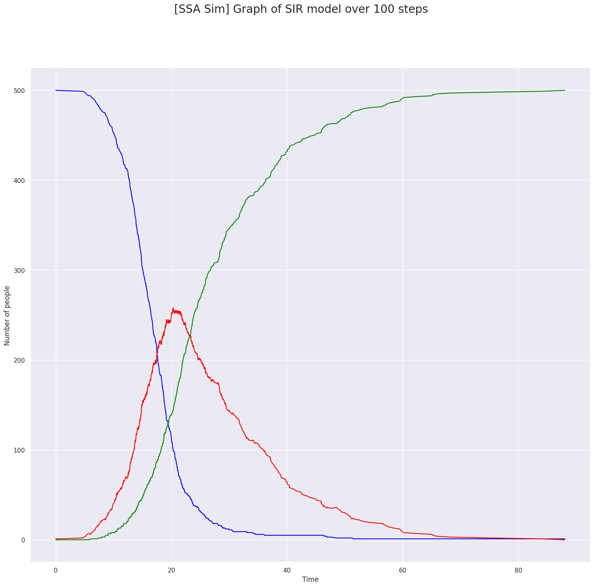

# Epidemic Simulation

> Teacher and Researcher: G. Beslon
>
> Date: December 7th, 2022

There exists several ways to do simulations in Computer Science. (More details inside `doc/approches_mathématiques_V5.pdf`)

* ODE Sim: Using Maths with Euler Method. This works on big systems with a lot of small components and should be understood as working on averages. The results are always the same.

* SSA Sim: Using RNG with Next Generation Algorithm (Gillespie). This creates an accurate simulation that follows the path of a chain of events, chosen using a part of randomness. Two simulations won't be equals. It should be understood as working on probabilities.

This was a cool 2h30 lab session to learn more about computer simulations.
